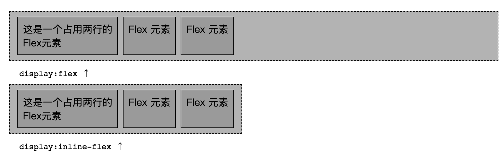

# CSS-弹性盒子布局

零零碎碎的接触弹性布局，但是一直都没有完全掌握，决定花费些精力彻底掌握。网络上实际上有很多文章，但是感觉都不是我的菜，还是自行总结的更加符合自己的思维习惯。

<!-- more -->

## 前言

在学习时，我总希望能在开始之前总览这个知识点的全局，虽然不一定能实现，但是掌控全局的安全感真的是无法拒绝啊。<span style="font-family: PingFang">😀</span>

这里我会尝试为弹性盒子布局绘制一个大图，总览全局。


### 定义（什么是弹性盒子？）

首先，我们了解什么是弹性盒子布局。这里引用CSS权威指南的描述：

> 弹性盒是一种简单而强大的布局方式，我们通过指定弹性盒声明空间的分布方式，内容的对齐方式和元素的视觉顺序，把不同的组件放置在页面中。

这里我们可以看到：

* 弹性盒是一种布局方式（布局当然是控制子元素咯）
* 可以使用弹性盒声明来控制布局
* 可控制的属性有：
  * 分布
  * 对齐
  * 顺序

### CSS控制属性概览

CSS使用属性声明来控制样式，所以我想要知道，弹性盒子布局中，提供了哪些属性来控制布局。

#### 概念

* 弹性容器：弹性盒子布局的父容器（使用display:flex 激活）
* 弹性元素：位于弹性盒子中的元素；

有些属性是应用在弹性容器上的， 有些属性是应用在弹性元素上面的。

#### 弹性盒子的两种类型（display）

我们通过将display设置为 flex 来启用弹性盒布局。设置时有两种类型：

* `flex` : 生成的弹性容器是块级框
* `inline-flex` : 生成的弹性容器是行内块级框



```html
<!DOCTYPE html>
<html lang="en">
<head>
    <meta charset="UTF-8">
    <title>Flex Type Demo</title>
</head>
<body>
<div id="one">
    <p> 这是一个占用两行的<br/>Flex元素 </p>
    <p> Flex 元素</p>
    <p> Flex 元素</p>
</div>
<p><code>display:flex ↑</code></p>
<div id="two">
    <p> 这是一个占用两行的<br/>Flex元素 </p>
    <p> Flex 元素</p>
    <p> Flex 元素</p>
</div>
<p><code>display:inline-flex ↑</code></p>
<style type="text/css">
    * {
        padding: 8px;
    }

    div#one {
        display: flex;
    }

    div#two {
        display: inline-flex;
    }

    div {
        border: 1px dashed;
        background: silver;
    }

    div > * {
        border: 1px solid;
        background: #AAA;
    }

    div p {
        margin: 0 4px;
    }

    body > p {
        margin: 0;
    }
</style>
</body>
</html>
```

#### 作用于弹性容器的CSS属性

包括如下属性：

* `flex-direction`： 定义弹性容器的==**主轴**==
* `flex-wrap`： 是否允许弹性元素**换行**
* `flex-flow`： `flex-direction`和 `flex-wrap` 的简写
* `justify-content`: 容器**主轴**上如何分布各行里的弹性元素（如何把弹性容器的空间分配到弹性元素的四周或者弹性元素之间）
* `align-items`: 弹性元素在**交叉轴**方向的对齐方式（对应的有一个应用于弹性元素的修改单个元素的对齐方式的属性-`align-self`）
* `aligin-content`: **交叉轴**方向上的额外空间如何分配到弹性元素之间和周围（针对有**多行**的弹性容器）


主要考虑分布和对齐，首先是确定方向即主轴。

#### 作用于弹性元素的CSS属性

包括如下属性：

* `felx`: 定义弹性增长因子/弹性缩减因子，`flex-grow`，`flex-shrink`，`flex-basis` 的简写形式
* `flex-grow`:  弹性增长因子，大于0的数
* `flex-shrink`: 弹性缩减因子，
* `flex-basis` : 定义弹性元素的初始或默认尺寸，即根据增长因子和缩减因子分配多余或缺少的空间之前，弹性元素的大小。
* `order`: 修改单个弹性元素的显示顺序。

也就是 `flex-grow`，`flex-shrink`，`flex-basis` 和 `order`。

另外需要注意的是：

* ==弹性元素的外边距不折叠==
* float 和 clear 属性对弹性元素不起作用。
* 绝对定位（`position:absolute`）会见弹性元素移除正常的文档布局流。


## 弹性盒子详解

### 详解弹性容器CSS属性


### 详解弹性元素CSS属性


# Grid

Grid 布局的属性分成两类。一类定义在容器上面，称为容器属性；另一类定义在项目上面，称为项目属性。

## 容器属性

* `display`： `grid`
* `grid-template-columns`属性定义每一列的列宽；
* `grid-template-rows`属性定义每一行的行高；


## 布局属性


