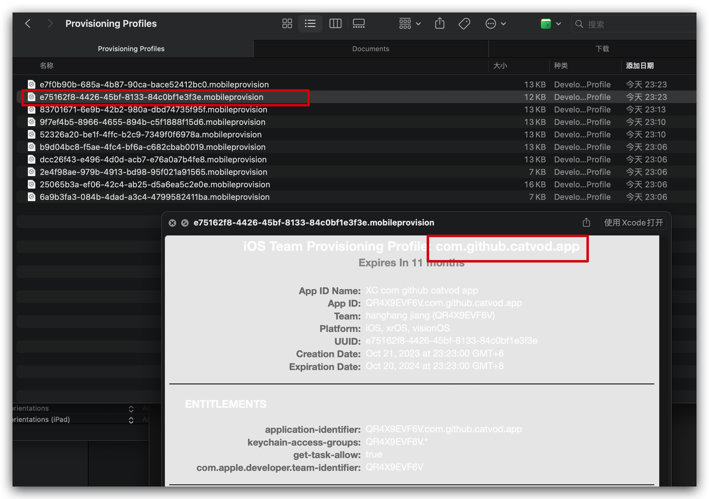

# iPhone及iPad 安装自签名应用

使用到的工具：

1. 爱思助手：用于打开开发者模式及安装应用；

2. IPA Resign Tools ：用于对 IPA进行签名

## 准备工作：获取签名文件

### 1. 获取对应的 mobileprovision

<mark>实际测试不需要 appId 一致也可以，随便新建一个项目复制出 mobileprovision 文件即可</mark>

使用 xcode 新建一个项目，bundle id 保持和需要签名的应用一致（直接使用 MacZip 软件打开 iPA 文件）：

查看 Info.plist 文件：

如上面的唯一 id 是：

<?xml version="1.0" encoding="UTF-8"?>

<!DOCTYPE plist PUBLIC "-//Apple//DTD PLIST 1.0//EN" "http://www.apple.com/DTDs/PropertyList-1.0.dtd">

<plist version="1.0">
<string>com.github.catvod.app</string>
</plist>

我们在 XCode 中新建一个 iOS 项目，设置组织 ID 和 Product Name：

Finder 中打开：`~/Library/MobileDevice/Provisioning Profiles`，然后找到对应的文件拷贝出来

### 2. P12 签名文件导出

钥匙串中找到对应的签名，然后导出即可，导出时需要设置密码，后续签名时需要用到

## 打开*开发者设置*

这里我们直接通过爱思助手来打开。

1. 安装爱思助手并连接设备

连接时，手机端会提示是否信任设备，此时选择信任即可。

2. 信任之后，去`设置-隐私与安全性-开发者模式中` 打开开发者模式，期间需要重启及输入密码，按照提示确认即可。

重启之后有提示，按照提示打开。

 

## 使用 IPA ResignTool 对 IPA 进行签名

## 安装应用

### 安装轻松签

由于我们的系统是iOS17，所以自行对轻松签的 ipa 进行签名，下载轻松签的 iPA 文件（下载链接：[轻松签 (yyyue.xyz)](https://esign.yyyue.xyz/)，打开后选择 `下载IPA`）
