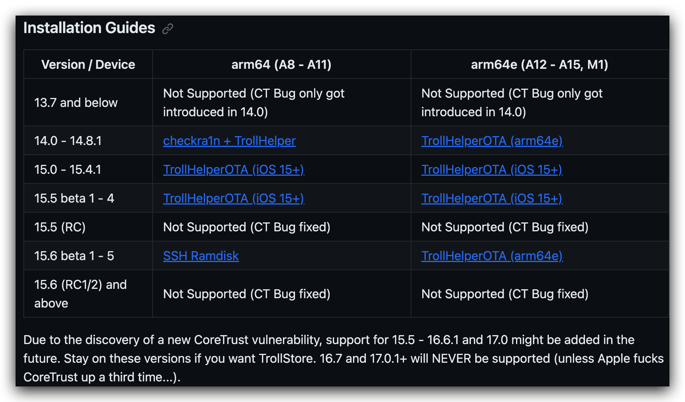
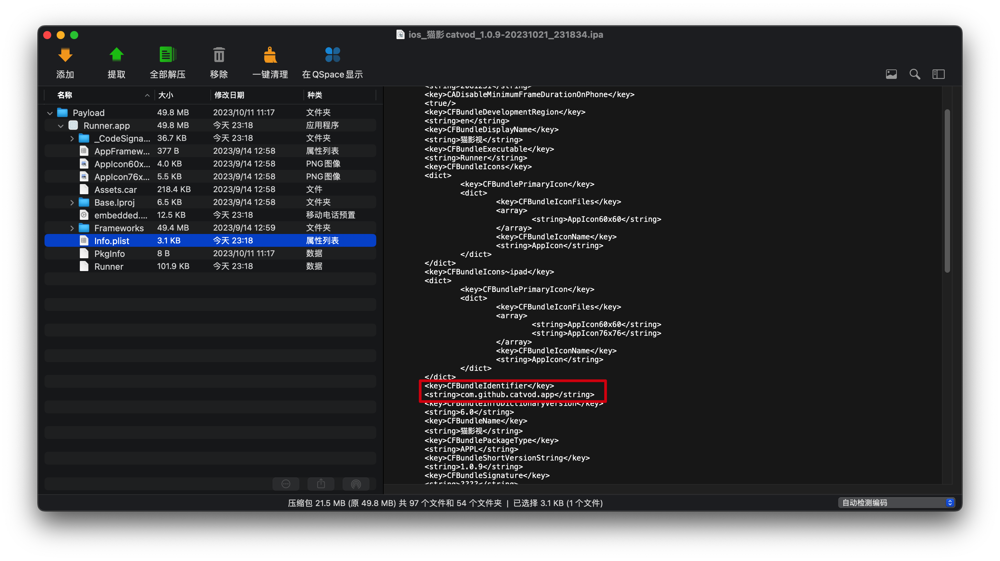
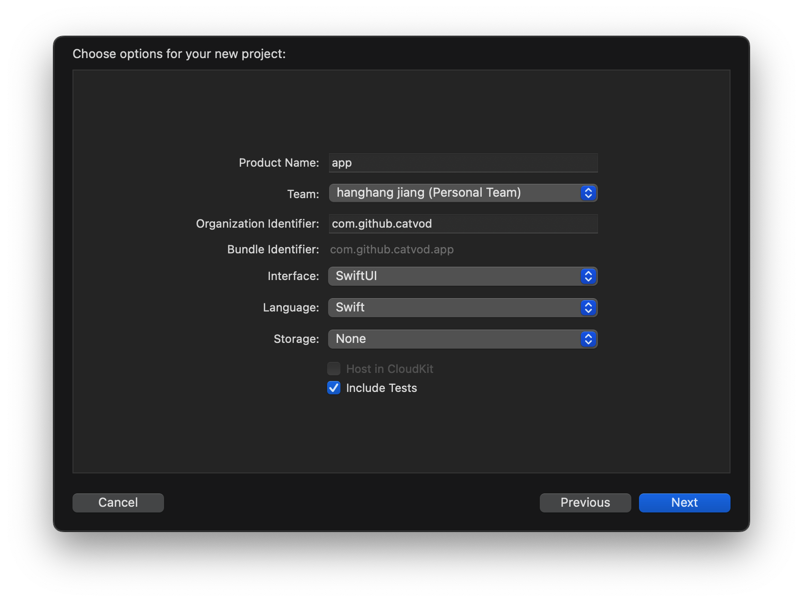
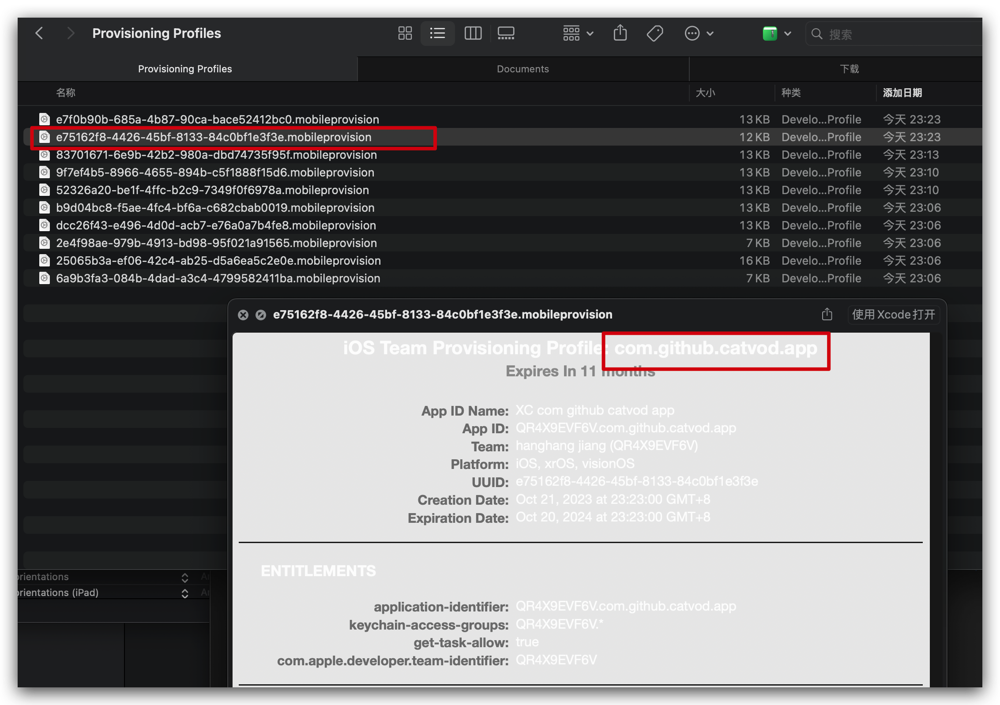
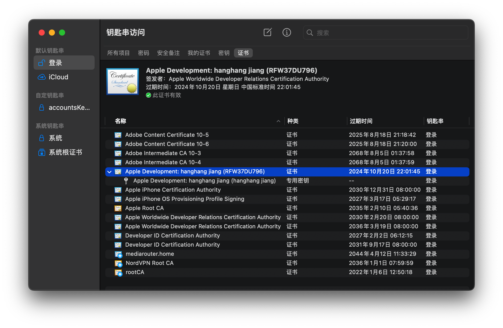
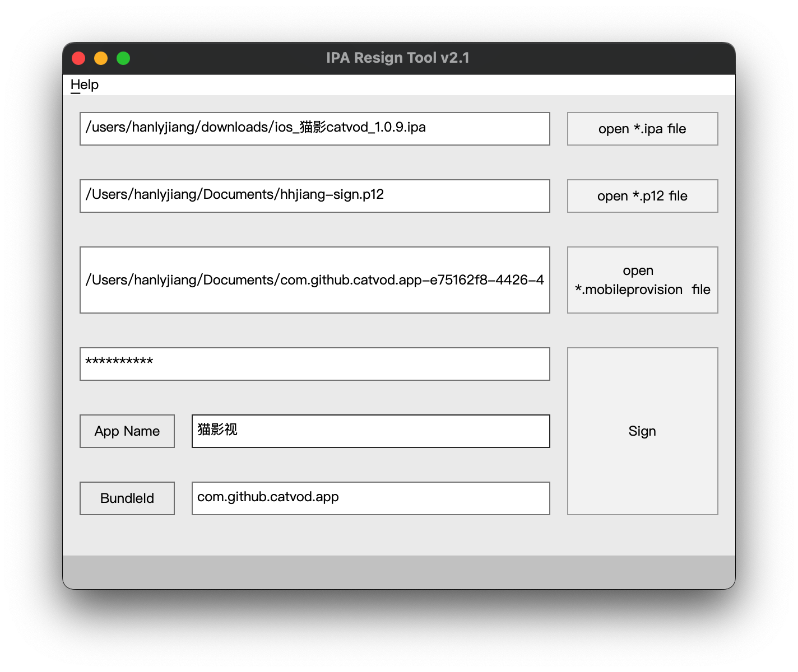
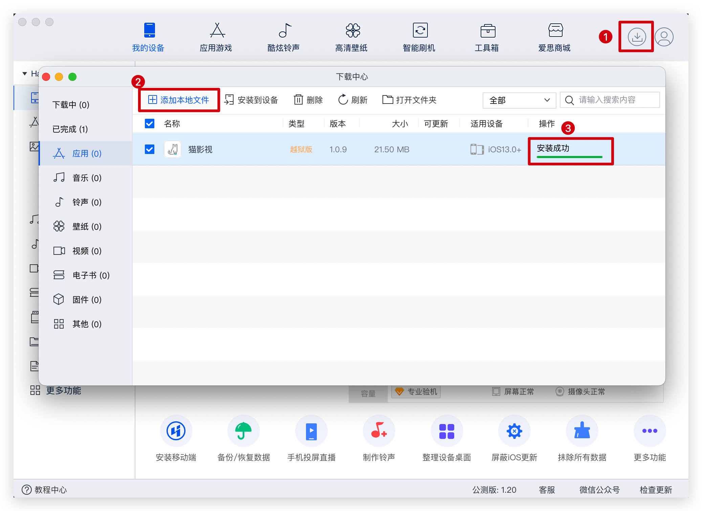

# iOS 签名 ipa 流程及工具使用说明

## 相关工具

- ~~[Releases · opa334/TrollStore (github.com)](https://github.com/opa334/TrollStore/releases)： 一个签名工具，当前不支持 17.0.1+~~
  
  - ~~支持情况：~~
    
    
    
    > Due to the discovery of a new CoreTrust vulnerability, support for 15.5 - 16.6.1 and 17.0 might be added in the future. Stay on these versions if you want TrollStore. **16.7 and 17.0.1+ will NEVER be supported (unless Apple fucks CoreTrust up a third time...).**

## 签名文件准备

### 1. 获取对应的 mobileprovision

<mark>实际测试不需要 appId 一致也可以，随便新建一个项目复制出 mobileprovision 文件即可</mark>

使用 xcode 新建一个项目，bundle id 保持和需要签名的应用一致（直接使用 MacZip 软件打开 iPA 文件）：

查看 Info.plist 文件：

如上面的唯一 id 是：

<?xml version="1.0" encoding="UTF-8"?>

<!DOCTYPE plist PUBLIC "-//Apple//DTD PLIST 1.0//EN" "http://www.apple.com/DTDs/PropertyList-1.0.dtd">

<plist version="1.0">
<string>com.github.catvod.app</string>
</plist>

我们在 XCode 中新建一个 iOS 项目，设置组织 ID 和 Product Name：

Finder 中打开：`~/Library/MobileDevice/Provisioning Profiles`，然后找到对应的文件拷贝出来

## 2. P12 签名文件导出

钥匙串中找到对应的签名，然后导出即可，导出时需要设置密码，后续签名时需要用到

## 下载 IPA Resign 工具

下载地址： [IPA Resign Tool on Windows and macos Platform (iosappsigner.github.io)](https://iosappsigner.github.io/)

支持 Windows 和 macOS 

## 安装

这里连接 iPhone 后使用 **爱思助手** 进行安装

