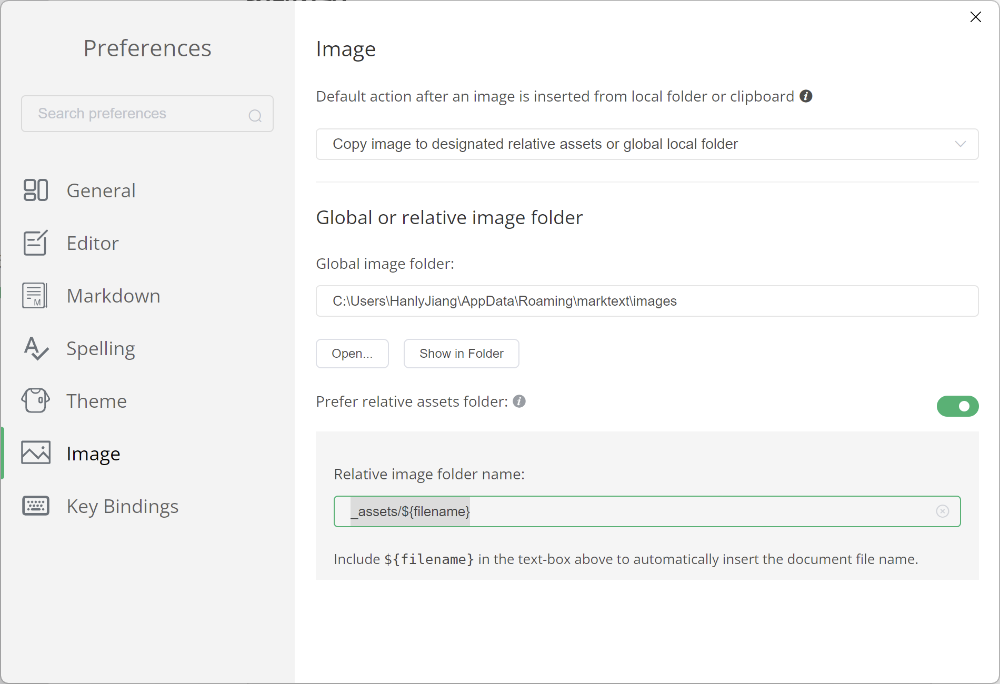

# 使用 MarkText 进行 MD 编辑

## 功能介绍

- 加载目录

- 同时打开多 Tab 

## 下载安装

1. 直接去 Github 下载：[marktext/marktext: 📝A simple and elegant markdown editor, available for Linux, macOS and Windows. (github.com)](https://github.com/marktext/marktext)

2. 使用命令获取： 
   
   - Windows： `winget install marktext`  或者 `choco install marktext`
   
   - macOS： `brew install --cask mark-text`

## 基础快捷键

最重要的： 

- `Ctrl + , ` 打开偏好设置

- `Ctrl+Shift+P` 打开命令面板

其他的只需要 通过 命令面板进行搜索即可。

## Front matter

> 参考：[Obsidian 的 YAML Front matter 介绍 - 知乎 (zhihu.com)](https://zhuanlan.zhihu.com/p/370113792)

模板如下：

```yaml
---
title: '使用 MarkText 进行 MD 编辑'
date: 2023-10-19 21:52:50
tags: [MarkDown,MarkText]
published: true
hideInList: false
feature: 
isTop: false
---
```

## 图表支持

> 待补充

# 配置

## 图片配置



配置值：`_assets/${filename}`

- 使用一个顶层目录存储，可以保持整洁

- 使用文件名，可以方便识别关系，所以文件的命名就很重要

- 只存储到本地，避免图床不稳定导致
